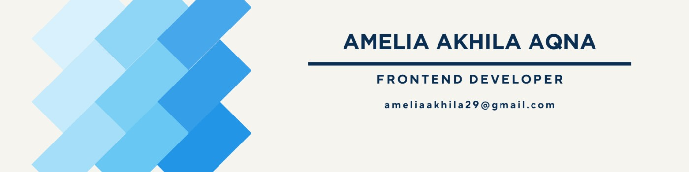

<div align="center">

<!-- Animated Header Banner -->
<a href="#" onclick="return false;">
  
</a>

<!-- Animated Icon Row -->
<p align="center">
  
</p>

<h3 style="color: #0066cc; margin: 15px 0; font-size: 18px;">
🚀 Building Beautiful UIs & Intelligent Algorithms
</h3>

<!-- Quick Connect Badges -->
<p align="center">
  </a>
  <a href="https://www.linkedin.com/in/amelia-akhila-05339622a/" target="_blank">
    
  </a>
  <a href="https://ameliaakhila.github.io/ameliacv.github.io/" target="_blank">
    
  </a>
  <a href="mailto:ameliaakhila29@gmail.com?subject=Hello Amelia&body=Halo Amelia, saya ingin menghubungi Anda terkait penawaran proyek." target="_blank">
    
  </a>
</p>

---

</div>

## 👋 About Me

<div align="center">

```
  ┏━━━━━━━━━━━━━━━━━━━━━━━━━━━━━━━━━━━━━━━━┓
  ┃       🎯 Passionate Web Developer       ┃
  ┃       🚀 AI & ML Enthusiast             ┃
  ┃       💡 Creative Problem Solver        ┃
  ┃       🤝 Open to Collaboration          ┃
  ┗━━━━━━━━━━━━━━━━━━━━━━━━━━━━━━━━━━━━━━━━┛
```

</div>

<details open>
<summary><strong>📍 Quick Facts</strong></summary>

| 🎯 | What I Do |
|----|----|
| 🎨 | Build stunning, responsive web interfaces |
| 🤖 | Explore AI/ML and Data Science |
| 💻 | Write clean, efficient code |
| 📊 | Turn data into insights |
| 🔧 | Full-stack web development |

</details>

---

## �️ Tech Stack

<div align="center">

### 🎨 Front-End
<p>
  
</p>

### ⚙️ Back-End & Scripting  
<p>
  
</p>

### 🤖 AI & Data Science
<p>
  
  
</p>

### 📊 Data Visualization & Analytics
<p>
  
  
  
</p>

### �️ Database Management
<p>
  
</p>

### 🛠️ Development & Testing Tools
<p>
  
</p>

</div>

---

## 📊 GitHub Statistics

<div align="center">


</div>

---

## 🎪 Featured Projects

<div align="center">

### 🌐 Web Development Projects

<table>
<tr>
<td width="50%" align="center">

**� Learn Laravel 12**  
[View Repo →](https://github.com/ameliaakhila/learn-laravel-12)

Website edukasi sederhana menggunakan Laravel 12, menampilkan artikel/blog, halaman About, Contact, dan fitur kategori.

```
Laravel 12 • PHP • MySQL
```


</td>
<td width="50%" align="center">

**💊 Sistem Apotek Kencana**  
[View Repo →](https://github.com/ameliaakhila/sistem-apotek-kencana)

Sistem manajemen apotek lengkap dengan fitur inventory dan transaksi.

```
Laravel • PHP • Database
```


</td>
</tr>
<tr>
<td width="50%" align="center">

**🎨 Basic Front-End**  
[View Repo →](https://github.com/ameliaakhila/Basic-Front-End)

Proyek dasar front-end dengan HTML, CSS, dan JavaScript untuk pembelajaran fundamental web development.

```
HTML • CSS • JavaScript
```


</td>
<td width="50%" align="center">

**⚛️ Belajar React untuk Pemula**  
[View Repo →](https://github.com/ameliaakhila/belajar-react-untuk-pemula)

Dokumentasi lengkap pembelajaran React dari konsep dasar hingga membuat komponen yang lebih kompleks.

```
React • JavaScript • JSX
```


</td>
</tr>
</table>

---

### 🤖 AI & Machine Learning Projects

<table>
<tr>
<td width="50%" align="center">

**📚 Buku Machine Learning**  
[View Repo →](https://github.com/ameliaakhila/Buku-Machine-Learning)

Mempelajari alur mengelola data, analisa data, dan semua mengenai machine learning yang tidak hanya untuk akurasi melainkan keseimbangan data dan keterkaitan data yang akan dilatih.

```
Python • Pandas • Machine Learning
```


</td>
<td width="50%" align="center">

**📊 Supervised Learning - Klasifikasi**  
[View Repo →](https://github.com/ameliaakhila/Supervised-Learning-Klasifikasi)

Prediksi customer churn menggunakan machine learning classification. Membandingkan 5 algoritma dengan akurasi tertinggi **96.85%** menggunakan Random Forest.

```
Python • Scikit-learn • Classification
```


</td>
</tr>
<tr>
<td width="50%" align="center">

**🏠 House Prices API Flask**  
[View Repo →](https://github.com/ameliaakhila/latihan-membuat-api-flask-House-Prices)

Latihan membuat API Flask dengan dataset 'House Prices - Advanced Regression Techniques' untuk masalah regresi. Belajar dari course Dicoding (Pijak in collaboration with IBM SkillsBuild).

```
Flask • Python • Regression
```


</td>
<td width="50%" align="center">

**🍎 Classification Apple**  
[View Repo →](https://github.com/ameliaakhila/clasification-apple)

Web application untuk mengklasifikasi apel berdasarkan atribut seperti diameter, berat, kandungan gula, warna, asal, dan musim panen menggunakan machine learning.

```
Flask • ML • Python
```


</td>
</tr>
</table>

</div>

## � My Approach

<div align="center">

```
Design  →  Develop  →  Test  →  Deploy  →  Monitor
🎨         💻        ✅        🚀        📊
```

**Focus on:** Clean Code • Best Practices • User Experience • Performance

</div>

---

## 🤝 Let's Connect!

<div align="center">

<p align="center">
  <a href="https://www.linkedin.com/in/amelia-akhila-05339622a/" target="_blank">
    
  </a>
  <a href="mailto:ameliaakhila29@gmail.com?subject=Hello Amelia&body=Halo Amelia, saya ingin menghubungi Anda terkait penawaran proyek." target="_blank">
    
  </a>
</p>

### 📬 Open For:

<table align="center">
<tr>
<td align="center">

**🚀 Projects**

Freelance & Collaboration

</td>
<td align="center">

**💼 Opportunities**

Full-time & Contract

</td>
<td align="center">

**🤝 Community**

Open Source & Ideas

</td>
</tr>
</table>

</div>

---

<div align="center">

### 🌟 Thanks for visiting! Feel free to explore my repositories.

**Building amazing things, one line of code at a time! 🩵**

<sub>by **Annezetya** | Designed with 🩵</sub>

</div>
